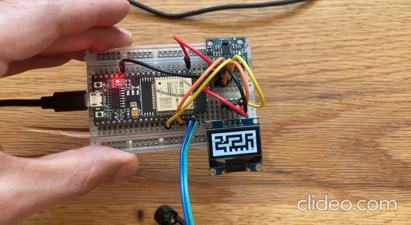

# ESP32 Tilt Maze Game

A classic tilt-controlled maze game powered by an ESP32 microcontroller and an MPU6050 motion sensor. Tilt the physical device to guide a ball through a digital maze on an OLED display.

## Gameplay Video

---

## Hardware Required

To build this project, you will need the following components:

| Component                       | Quantity | Notes                                      |
| ------------------------------- | :------: | ------------------------------------------ |
| ESP32 Development Board         |    1     | Any common ESP32 board will work.          |
| MPU6050 Gyro/Accelerometer      |    1     | The core motion sensor.                    |
| 128x64 I2C OLED Display         |    1     | SSD1306 driver is most common.             |
| Passive or Active Buzzer        |    1     | For sound effects.                         |
| Breadboard                      |    1     | For prototyping.                           |
| Jumper Wires                    | Several  | To connect the components.                 |

---

## Software & Libraries

This project is built using the Arduino IDE.

1.  **Install Libraries:** Install the following libraries through the Arduino IDE's Library Manager (**Tools -> Manage Libraries...**):
    - `Adafruit GFX Library` by Adafruit
    - `Adafruit SSD1306` by Adafruit
    - `Adafruit MPU6050` by Adafruit
      - *(When installing, the IDE will ask to install dependencies like `Adafruit Unified Sensor`. Click "Install all".)*

---

## Wiring Diagram

Connect the components according to the diagram below. All components should be powered by the **3.3V** output from the ESP32.

| Component Pin     | Connect to ESP32 Pin |
| ----------------- | -------------------- |
| **MPU6050 VCC** | `3V3`                |
| **MPU6050 GND** | `GND`                |
| **MPU6050 SCL** | `GPIO 22`            |
| **MPU6050 SDA** | `GPIO 21`            |
| **OLED VCC** | `3V3`                |
| **OLED GND** | `GND`                |
| **OLED SCL** | `GPIO 22` (Shared)   |
| **OLED SDA** | `GPIO 21` (Shared)   |
| **Buzzer (+) leg**| `GPIO 23`            |
| **Buzzer (-) leg**| `GND`                |

*Note: The OLED and MPU6050 share the same I2C bus (`SDA`/`SCL` pins), which is perfectly fine as they have different I2C addresses.*

---

## How to Play

1.  **Upload the Code:** Open the `maze-game.ino` file in the Arduino IDE, select your ESP32 board and COM port, and click Upload.
2.  **Start the Game:** Hold the device flat to begin. A start-up sound will play.

---

## Contributing

Contributions are welcome! If you have ideas for new features, bug fixes, or improvements, feel free to:

1.  **Fork the repository.**
2.  **Create a new branch** (`git checkout -b feature/your-new-feature`).
3.  **Make your changes.**
4.  **Commit your changes** (`git commit -am 'Add some feature'`).
5.  **Push to the branch** (`git push origin feature/your-new-feature`).
6.  **Create a new Pull Request.**

---

## License

This project is licensed under the MIT License.
